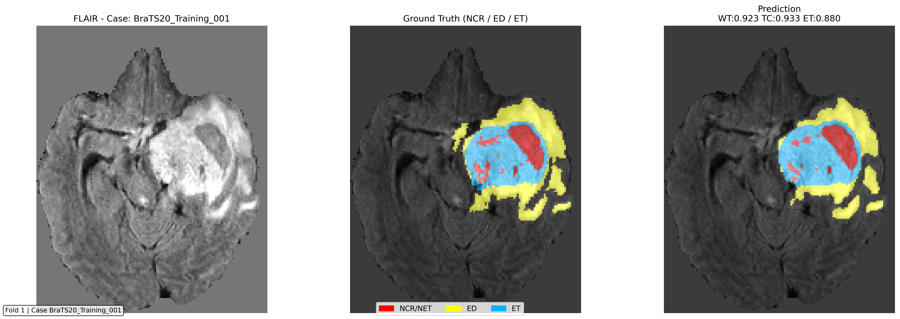
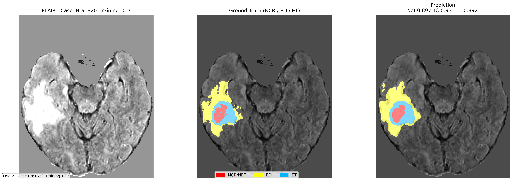
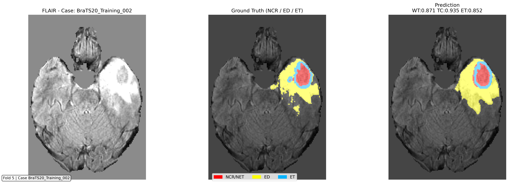

# 🧠 Optimized 3D Attention U-Net for Glioma Segmentation

[](https://pytorch.org/)
[](https://monai.io/)
[](https://www.python.org/)
[](https://opensource.org/licenses/MIT)

> **Note:** This repository focuses on documenting the **model architecture** and the overall **processing/evaluation pipeline**. It is designed as a reference implementation rather than a complete training framework. Researchers are encouraged to adapt the training loops to their specific requirements.

---

## 📖 1. Introduction

This project presents an **optimized implementation of 3D Attention U-Net** for multi-class glioma segmentation on the **BraTS 2020** dataset.

Rather than introducing unnecessary architectural complexity, we focus on improving optimization behavior and training stability. Our ablation experiments (3-fold, 50 epochs) demonstrate that these refinements yield smoother convergence dynamics, particularly for the challenging Tumor Core (TC) region.

### 🚀 Key Refinements

We introduce three strategic modifications to the standard architecture:

1.  **Instance Normalization:** Replaced Batch Normalization to ensure stable feature scaling under micro-batch ($N=1$) 3D training.
2.  **LeakyReLU Activation:** Adopted to maintain gradient flow in low-activation regimes, which are common in hypointense MRI regions.
3.  **Calibrated Attention Gates:** Implemented a positive bias shift ($\beta \in [1.5, 2.0]$) to improve early feature transmission and mitigate premature gate saturation.

---

## 🛠️ 2. Method: The "Open-Gate" Strategy

The core innovation lies in our handling of the **AttentionBlock**. This block filters skip-connection features, allowing the decoder to focus on task-relevant information.

### The Problem: Suboptimal Gradient Flow

In standard **Attention Gates (AGs)**, zero-bias initialization often leads to low initial sigmoid activations. This can cause:

- **Feature Suppression:** Important encoder features are prematurely attenuated before the model learns to identify relevant spatial regions.
- **Convergence Instability:** The initial "closed-gate" state restricts the flow of gradients, making it difficult for the model to exit local minima in early epochs, particularly in high-variance regions like the Tumor Core.

---

### The Solution: Weighted Bias Initialization

To ensure more stable convergence dynamics, we shift the initial state toward a more **permissive configuration**:

- **Mechanism:** By setting the affine bias $\beta \in [1.5, 2.0]$, the initial gate activation is shifted to $\alpha \approx 0.82 \text{--} 0.88$.
- **Result:** This "near-open" state ensures that encoder features pass through almost freely during the initial phase.
- **Optimization:** Instead of struggling to "open" the gate, the model focuses on refining the attention map, leading to a much smoother loss trajectory and sustained performance gains in later epochs.

---

## 📊 3. Performance

### Quantitative Results (5-Fold Cross-Validation)

The model achieves high segmentation accuracy across all tumor sub-regions, with the Whole Tumor (WT) class exceeding **0.90 DSC**.

| Metric               | Class  |      Mean ± Std      |   Median   |
| :------------------- | :----: | :------------------: | :--------: |
| **DSC (Dice Score)** | **WT** | **0.9009 ± 0.0842**  | **0.9255** |
|                      |   TC   |   0.8505 ± 0.1580    |   0.9178   |
|                      |   ET   |   0.8103 ± 0.1791    |   0.8718   |
| **HD95 (mm)**        | **WT** | **8.1907 ± 13.5499** | **3.7416** |
|                      |   TC   |   7.2373 ± 12.8598   |   3.0000   |
|                      |   ET   |   5.6587 ± 11.2767   |   1.7320   |

### 🖼️ Visualization

Representative slices from validation folds showcasing the segmentation quality. The model exhibits consistent morphology capture across different patients.

<p align="center">
  
  
  
</p>

---

## ⚙️ 4. Installation & Setup

## ⚙️ 4. Installation & Setup

Follow these steps to configure your environment and prepare the dataset for experiments.

### 4.1. Prerequisites & Dependencies

This project requires **Python 3.8+**. It is recommended to use a virtual environment (Conda or venv). Install the core libraries using the command below:

```bash
pip install --upgrade monai[all] torch nibabel numpy pandas matplotlib seaborn scikit-learn tqdm


PyTorch: Deep learning framework.MONAI: Specialized framework for healthcare imaging (3D transforms, DiceLoss, and U-Net layers).Nibabel: For processing medical imaging formats (.nii.gz).4.2. Dataset PreparationThe model is evaluated on the BraTS 2020 (Brain Tumor Segmentation) dataset.Download: Access the dataset on Kaggle:👉 BraTS 2020 Training DataStructure: After extraction, ensure your data directory is organized as follows:PlaintextMICCAI_BraTS2020_TrainingData/
├── BraTS20_Training_001/
│   ├── BraTS20_Training_001_flair.nii.gz
│   ├── BraTS20_Training_001_t1ce.nii.gz
│   └── ...
└── ...
4.3. ConfigurationUpdate the absolute path to your dataset in the configuration file to enable the data loader.File: config/config.pyVariable: DATA_PATHPythonfrom pathlib import Path

# Update this path to match your local dataset directory
DATA_PATH = Path("/your/local/path/to/MICCAI_BraTS2020_TrainingData")
🏃‍♂️ 5. Usage GuideThe train.py script serves as the main entry point for both training and evaluation phases.5.1. Model SelectionYou can toggle between the baseline and our optimized architecture:optimized_unet3d: Our proposed model featuring Bias-Shifted Attention, InstanceNorm, and LeakyReLU.attention_unet3d: The standard 3D Attention U-Net baseline.5.2. Running ExperimentsFull Training & Validation: Execute a 5-fold cross-validation run:Bashpython train.py --model_name optimized_unet3d --epochs 100 --kfold 5
Inference Only: Skip the training process and run evaluation using existing weights:Bashpython train.py --model_name optimized_unet3d --skip_train
5.3. Arguments ReferenceArgumentTypeDefaultDescription--model_namestroptimized_unet3dChoose between optimized_unet3d or attention_unet3d.--epochsint100Number of training iterations.--kfoldint5Number of folds for cross-validation.--skip_trainflagFalseSkips training and runs inference on the validation set.
```
